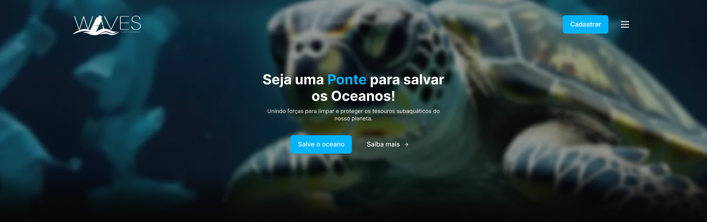

  

<h1 align="center">
  Waves Sustentabilidade
</h1>

  Waves Sustentabilidade é um site fullstack desenvolvido para ajudar na causa da preservação dos oceanos, permitindo o agendamento de coleta e reciclagem de itens encontrados no mar.

## Visão Geral

Waves Sustentabilidade é uma plataforma online dedicada a unir pessoas interessadas em preservar os oceanos, oferecendo uma solução para o descarte e reciclagem responsável de itens encontrados no mar. O site permite o agendamento de coletas e a venda de itens reciclados, proporcionando uma forma sustentável de ganhar renda extra. Além disso, facilita a conexão entre os coletadores e recicladores, promovendo a troca de informações e recursos.

## Tecnologias Utilizadas

### Backend

- [Node.js](https://nodejs.org/)
- [Express.js](https://expressjs.com/)
- [PostgreSQL](https://www.postgresql.org/)
- [APIs do Google (para login e integração de mapas)](https://developers.google.com/)
- [Outras tecnologias utilizadas]

### Frontend

- [Next.js](https://nextjs.org/)
- [APIs do Google (para integração de mapas)](https://developers.google.com/)
- [Outras tecnologias utilizadas]

## Funcionalidades

- **Agendamento de Coletas:** Usuários podem agendar coletas de itens recicláveis encontrados no mar.
- **Venda de Itens Reciclados:** Usuários podem vender itens reciclados através da plataforma.
- **Integração Frontend e Backend:** Frontend desenvolvido com Next.js integrado ao backend Node.js para uma experiência completa.
- **Login com Google:** Utilização da API de login do Google para autenticação de usuários.
- **Integração de Mapas:** Utilização da API de mapas do Google para visualização de pontos de coleta e entrega.
- **Conexão entre Coletador e Reciclador:** Facilita a comunicação e a troca de informações entre os coletadores e recicladores.
- **Chat:** Possibilidade de comunicação via chat entre os usuários para coordenar a coleta e reciclagem de itens.
- [Outras funcionalidades]

## Como Contribuir

Se você quiser contribuir para o desenvolvimento do Waves Sustentabilidade, siga estas etapas:

1. Faça um fork do repositório
2. Crie uma branch para sua feature (`git checkout -b feature/MinhaFeature`)
3. Faça commit das suas mudanças (`git commit -am 'Adiciona minha nova feature'`)
4. Faça push para a branch (`git push origin feature/MinhaFeature`)
5. Abra um Pull Request

## Como Rodar o Projeto Localmente

Para executar o Waves Sustentabilidade localmente, siga estas etapas:

1. Clone este repositório: `git clone https://github.com/seu-usuario/waves-sustentabilidade.git`
2. Acesse o diretório do projeto: `cd waves-sustentabilidade`
3. Instale as dependências do backend: `cd backend && npm install` ou `cd backend && yarn install`
4. Configure o banco de dados PostgreSQL e atualize as variáveis de ambiente conforme necessário.
5. Inicie o servidor backend: `npm start` ou `yarn start`
6. Instale as dependências do frontend: `cd .. && cd frontend && npm install` ou `cd .. && cd frontend && yarn install`
7. Inicie o servidor frontend: `npm run dev` ou `yarn dev`
8. Acesse o site em seu navegador: `http://localhost:3000`

## Contribuidores

- Nome do Contribuidor (@username)
- Nome do Contribuidor (@username)
- [Lista de todos os contribuidores]

## Licença

Este projeto é licenciado sob a [Licença XYZ](https://example.com/licenca).
